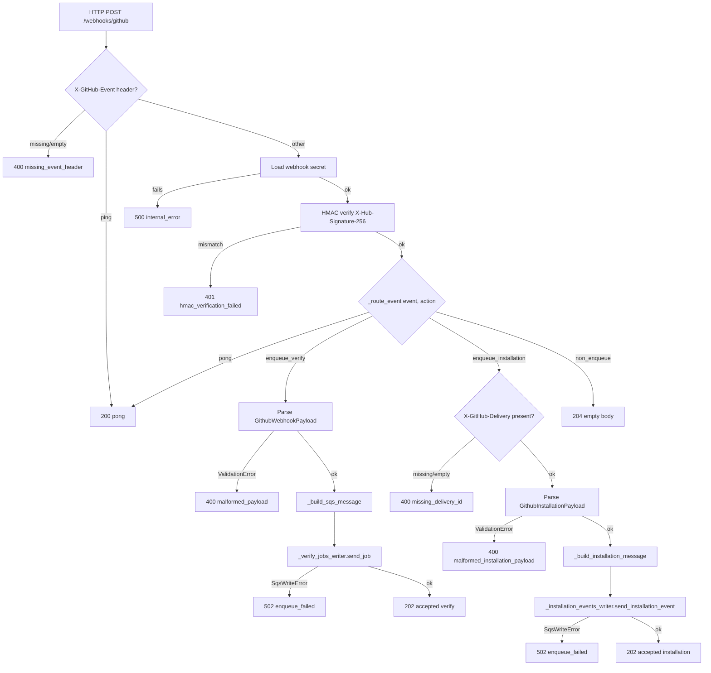

# Design Document

## 1. Overview

This amendment extends the Trikon Cloud **Webhook_Receiver** (Spec 1, at `.kiro/specs/trikon-cloud-webhook-receiver/`) so that GitHub App installation-lifecycle deliveries — the `installation` and `installation_repositories` event types — are validated, mapped to Spec 3's `InstallationEventMessage`, and enqueued on the **`trikon-cloud-installation-events`** SQS queue owned by the `trikon-cloud-orchestrator` stack. The existing `pull_request` verification path, the HMAC verification, the PII-redacting logger, and every one of Spec 1's 49 shipping tests remain untouched. The message shape (`InstallationEventMessage`) is imported from `trikon_cloud.installation_lifecycle.models`, so producer (this Lambda) and consumer (Spec 3's Lifecycle_Handler) share a single source of truth.

The receiver's shipping design.md §7 enumerates a **13-path never-fail-open** decision tree from request-arrival to HTTP response (see `trikon_cloud/webhook_receiver/handler.py` docstring, which cites the same enumeration). Exactly one path returns `200` (the `ping` short-circuit), exactly one returns `202` (successful `pull_request` enqueue), and every other path returns a `4xx`/`5xx`. This amendment **extends the decision tree to 15 paths** by inserting two new terminals — one for successful installation-event enqueue (`202`) and one for malformed installation-event payload (`400`) — without altering any of the original 13 outcomes. The extension is purely additive; the router picks the new branches only for event types that used to fall through to path 9 (the `204` non-enqueue default).

### 1.1 Request-flow diagram



Four branches diverge from the Event-Type Router (`_route_event`): `pong`, `enqueue_verify`, `enqueue_installation`, and `non_enqueue`. Two of those (`pong`, `non_enqueue`) terminate at a single response; the two enqueue branches each have a payload-parse fork and an enqueue fork, giving the 15-path total. See §6 for the full enumeration.

## 2. Module Boundaries and Changes

Six source files and one test file are touched. No file outside the tables below changes.

### 2.1 Files this spec modifies

| File | Change kind | Summary |
|------|-------------|---------|
| `trikon_cloud/webhook_receiver/handler.py` | extended | Add `enqueue_installation` branch. New helpers `_get_installation_events_writer`, `_build_installation_message`. Extend `_route_event` return `Literal`. Capture `sent_at` at handler entry. Import `InstallationEventMessage` from Spec 3. |
| `trikon_cloud/webhook_receiver/models.py` | extended | Add nested models `GithubInstallationRef`, `GithubInstallationRepository`, and top-level `GithubInstallationPayload`. Add `installation_events_queue_url` field to `ReceiverEnvConfig`. |
| `trikon_cloud/webhook_receiver/sqs_writer.py` | extended | Add `send_installation_event(message: InstallationEventMessage) -> None` method. Extract shared private `_send_body(body: str)` helper. `__init__` and `send_job` unchanged (see §7 for rationale). |
| `trikon_cloud/webhook_receiver/infra/webhook_receiver_stack.py` | extended | Add `installation_events_queue_arn: str` constructor kwarg. Import the queue by ARN, plumb its `queue_url` into the Lambda's environment as `TRIKON_INSTALLATION_EVENTS_QUEUE_URL`, and grant `sqs:SendMessage` on the imported ARN. |
| `trikon_cloud/webhook_receiver/infra/app.py` | extended | Read `installation_events_queue_arn` from CDK context; raise `ValueError` if missing; forward to the stack. |
| `trikon_cloud/webhook_receiver/tests/test_handler.py` | patched | No behavioural change. Only edit is where existing tests reference `SqsWriter(queue_url=…)` — that call already matches the new signature (see §7), so this row exists only to document that we verified no other tests need updating. |

### 2.2 Files this spec adds

| File | Purpose |
|------|---------|
| `trikon_cloud/webhook_receiver/tests/test_installation_events_routing.py` | ≥15 new tests covering routing, payload mapping, HTTP status codes, queue-picker isolation, and `sent_at` capture. |

### 2.3 Files this spec explicitly does not touch

- `trikon_cloud/webhook_receiver/hmac_verifier.py` — HMAC verification is preserved verbatim (Requirement 7.4, 1.6).
- `trikon_cloud/webhook_receiver/logger.py` — the PII-redacting logger is unchanged.
- `trikon_cloud/webhook_receiver/tests/test_hmac_verifier.py`, `test_models.py`, `test_sqs_writer.py`, `test_logger.py`, `conftest.py` — these tests continue to pass without edits. `conftest.py` fixtures are reused by the new test file.
- `trikon_cloud/installation_lifecycle/**` — Spec 3 is imported (for `InstallationEventMessage`), never modified (Requirement 7.6).
- `trikon_cloud/installation_lifecycle/infra/**` — Spec 3's `OrchestratorStack` continues to own queue creation (Requirement 7.7).
- `pyproject.toml` — no new runtime or dev dependency is introduced (Requirement 7.5).

### 2.4 Public API surface added or changed

The table below lists every function, class, and Pydantic field this spec adds or alters. No signature uses `Any` or `dict[str, Any]` (Requirement 7.2).

| Symbol | Signature | Module | Notes |
|--------|-----------|--------|-------|
| `GithubInstallationRepository` | `class GithubInstallationRepository(BaseModel)` — field `full_name: str`; `frozen=True`, `extra="allow"` | `models.py` | New. |
| `GithubInstallationRef` | `class GithubInstallationRef(BaseModel)` — fields `id: int = Field(ge=1)`, `app_id: int = Field(ge=1)`; `frozen=True`, `extra="allow"` | `models.py` | New. |
| `GithubInstallationPayload` | `class GithubInstallationPayload(BaseModel)` — see §3 for the field list | `models.py` | New top-level model. |
| `ReceiverEnvConfig.installation_events_queue_url` | `installation_events_queue_url: str = Field(alias="TRIKON_INSTALLATION_EVENTS_QUEUE_URL")` | `models.py` | New field on the existing settings class. |
| `_Route` | `Literal["enqueue_verify", "enqueue_installation", "pong", "non_enqueue"]` | `handler.py` | Replaces the shipping 3-value `Literal`. |
| `_route_event` | `def _route_event(event_type: str, action: str \| None) -> _Route` | `handler.py` | Extended; body in §4. |
| `_build_installation_message` | `def _build_installation_message(payload: GithubInstallationPayload, event_type: str, delivery_id: str, sent_at: str) -> InstallationEventMessage` | `handler.py` | New helper; body in §5. |
| `_get_installation_events_writer` | `def _get_installation_events_writer() -> SqsWriter` | `handler.py` | New module-level lazy accessor. |
| `SqsWriter.send_installation_event` | `def send_installation_event(self, message: InstallationEventMessage) -> None` | `sqs_writer.py` | New public method; body in §7. |
| `WebhookReceiverStack.__init__` | now takes `installation_events_queue_arn: str` keyword arg (see §8) | `infra/webhook_receiver_stack.py` | Backward-incompatible constructor change; the app.py entry is updated in the same spec. |

## 3. New Pydantic Models

All three new models sit alongside the existing `GithubWebhookPayload` / `SqsJobMessage` / `ReceiverEnvConfig` in `trikon_cloud/webhook_receiver/models.py`. They share the same file-scope `# mypy: disable-error-code="explicit-any"` header the existing models already carry (documented in `models.py`'s file docstring), and the same `from __future__ import annotations`.

### 3.1 `GithubInstallationRepository`

Represents one entry inside either `payload.repositories` (installation.created) or `payload.repositories_added` / `payload.repositories_removed` (installation_repositories). GitHub's actual repository object carries ~30 keys; the receiver reads only `full_name`.

```python
class GithubInstallationRepository(BaseModel):
    """One repository reference inside an installation event payload.

    Corresponds to entries of ``payload.repositories`` (installation.created)
    and ``payload.repositories_added`` / ``payload.repositories_removed``
    (installation_repositories.added / .removed). Only ``full_name`` is
    consumed by the receiver; ``extra="allow"`` lets GitHub add fields
    over time without failing validation.
    """

    model_config = ConfigDict(extra="allow", frozen=True)

    full_name: str
```

`frozen=True` matches the model shape used by Spec 3's `InstallationEventMessage` — the receiver is a producer and consumers should not observe post-construction mutation.

### 3.2 `GithubInstallationRef`

Corresponds to `payload.installation`, present on both `installation` and `installation_repositories` deliveries. Two integer fields are consumed: `id` (the installation identifier) and `app_id` (the GitHub App identifier). GitHub documents both as positive integers.

```python
class GithubInstallationRef(BaseModel):
    """The ``payload.installation`` reference on installation events.

    Present on both ``installation`` and ``installation_repositories``
    event types. Both integers are consumed unchanged and echoed onto
    :class:`InstallationEventMessage`.
    """

    model_config = ConfigDict(extra="allow", frozen=True)

    id: int = Field(ge=1)
    app_id: int = Field(ge=1)
```

`ge=1` mirrors the `InstallationEventMessage.installation_id: int = Field(ge=1)` constraint on the wire model, so a zero or negative value fails at the ingress boundary rather than at Spec 3's `extra="forbid"` parse — the receiver's `400 malformed_installation_payload` response is more actionable than a mysterious message-lost-in-DLQ.

### 3.3 `GithubInstallationPayload`

The top-level payload shape covering both `installation` and `installation_repositories` events. GitHub uses distinct top-level keys for the repository lists depending on the (event, action) pair:

| Event type | Action | Repository list key |
|------------|--------|---------------------|
| `installation` | `created` | `repositories` |
| `installation` | `deleted` | (none present in payload) |
| `installation_repositories` | `added` | `repositories_added` |
| `installation_repositories` | `removed` | `repositories_removed` |

Rather than three separate models with a discriminated union, one model with three optional list fields keeps the shape simple. The helper `_build_installation_message` picks the correct list based on the (event_type, action) pair; unused list fields on any given payload are simply `None`.

```python
class GithubInstallationPayload(BaseModel):
    """Top-level GitHub payload for installation lifecycle events.

    Covers both ``X-GitHub-Event: installation`` (actions ``created``,
    ``deleted``, plus other actions GitHub sends that we drop) and
    ``X-GitHub-Event: installation_repositories`` (actions ``added``,
    ``removed``, plus others we drop).

    ``extra="allow"`` on this model and every nested model lets GitHub
    add fields over time without breaking validation. ``frozen=True``
    matches the immutability discipline of the SQS wire model
    (:class:`InstallationEventMessage`).

    Field selection semantics:

    * ``installation.created``: read ``repositories``.
    * ``installation.deleted``: emit ``()`` regardless of what the
      payload carries (Requirement 2.6).
    * ``installation_repositories.added``: read ``repositories_added``.
    * ``installation_repositories.removed``: read ``repositories_removed``.

    See :func:`trikon_cloud.webhook_receiver.handler._build_installation_message`
    for the field-mapping implementation.
    """

    model_config = ConfigDict(extra="allow", frozen=True)

    action: str
    installation: GithubInstallationRef
    repositories: tuple[GithubInstallationRepository, ...] | None = None
    repositories_added: tuple[GithubInstallationRepository, ...] | None = None
    repositories_removed: tuple[GithubInstallationRepository, ...] | None = None
```

Notes on the field types:

- `tuple[..., ...] | None` (rather than `list[...] | None`) preserves hashability — matches the `frozen=True` discipline.
- Pydantic v2 accepts JSON arrays and coerces to `tuple`; no custom validator needed.
- The three list fields are declared **individually** rather than as a discriminated union so the parse succeeds on any well-formed payload — the (event, action) → list-field selection happens later in `_build_installation_message`. If a payload for `installation.created` is missing `repositories`, validation still succeeds (the field is optional); the mapping helper is the layer that raises on structural mismatch.

### 3.4 `ReceiverEnvConfig` extension

One field is added to the existing `ReceiverEnvConfig` (which extends `BaseSettings`), matching the alias / no-default discipline used by the existing `verify_jobs_queue_url` field:

```python
class ReceiverEnvConfig(BaseSettings):
    """Lambda environment variables (shipping design.md §5.3, extended).

    Adds ``installation_events_queue_url``. Missing / empty
    ``TRIKON_INSTALLATION_EVENTS_QUEUE_URL`` at Lambda cold start raises
    :class:`pydantic.ValidationError`, mirroring the shipping behavior
    for ``TRIKON_VERIFY_JOBS_QUEUE_URL`` (Requirement 4.5).
    """

    webhook_secret_arn: str = Field(alias="TRIKON_WEBHOOK_SECRET_ARN")
    verify_jobs_queue_url: str = Field(alias="TRIKON_VERIFY_JOBS_QUEUE_URL")
    installation_events_queue_url: str = Field(
        alias="TRIKON_INSTALLATION_EVENTS_QUEUE_URL"
    )
    log_level: str = Field(default="INFO", alias="TRIKON_LOG_LEVEL")
    aws_region: str = Field(default="us-east-1", alias="AWS_REGION")
```

The `__all__` export list adds `GithubInstallationPayload`, `GithubInstallationRef`, and `GithubInstallationRepository` in that order (after the existing three symbols and before `ReceiverEnvConfig`, respecting the file's design.md §5 ordering rule).

## 4. Extended `_route_event`

The Event-Type Router grows from three routes to four. The shipping return type `Literal["enqueue", "pong", "non_enqueue"]` is renamed to `Literal["enqueue_verify", "enqueue_installation", "pong", "non_enqueue"]` — the shipping token `"enqueue"` is renamed to `"enqueue_verify"` so the two enqueue branches have symmetric names. This is a source-level rename inside the module; no test file outside `test_handler.py` references the literal by string.

### 4.1 Complete function body (new)

```python
_Route = Literal["enqueue_verify", "enqueue_installation", "pong", "non_enqueue"]


def _route_event(event_type: str, action: str | None) -> _Route:
    """Pure routing function over ``X-GitHub-Event`` + ``payload.action``.

    Extends the shipping router (Spec 1 design.md §7) with two
    installation-lifecycle routes:

    * ``ping`` → ``pong`` (unchanged; shipping path 4).
    * ``pull_request`` with action in ``{opened, synchronize}`` →
      ``enqueue_verify`` (unchanged behaviour; shipping paths 11-12).
      Renamed from ``"enqueue"`` to ``"enqueue_verify"``.
    * ``installation`` with action in ``{created, deleted}`` →
      ``enqueue_installation`` (new; Requirement 1.1, 1.2).
    * ``installation_repositories`` with action in ``{added, removed}``
      → ``enqueue_installation`` (new; Requirement 1.3, 1.4).
    * every other combination → ``non_enqueue`` (unchanged fail-closed
      default; shipping paths 8-9, extended by Requirement 1.5).
    """
    if event_type == "ping":
        return "pong"
    if event_type == "pull_request" and action in {"opened", "synchronize"}:
        return "enqueue_verify"
    if event_type == "installation" and action in {"created", "deleted"}:
        return "enqueue_installation"
    if event_type == "installation_repositories" and action in {"added", "removed"}:
        return "enqueue_installation"
    return "non_enqueue"
```

### 4.2 Note on `pull_request` accepted actions

The initial prompt draft proposed adding `"reopened"` to the `pull_request` accepted set. **We do not add it.** Spec 1's shipping router accepts exactly `{"opened", "synchronize"}`, and Spec 1's design.md §7 path 8 documents that any other `pull_request` action returns `204`. Requirement 1.7 of this spec requires that "the existing routing decisions" be preserved verbatim; introducing `"reopened"` in this amendment would be a behavioural change to a shipped, tested code path, breaking the non-regression contract in Requirement 6.1.

If we later want `reopened` (which is a defensible ask — a reopened PR carries a fresh head SHA and should re-verify), it is a separate spec that (a) updates Spec 1's design.md §7 to reflect the new accepted set, (b) adds a new `pull_request.reopened` test case, and (c) tightens the message-shape contract with Spec 3. **This spec does not touch that set.**

The requirements document lists `reopened` inside Requirement 1.7's descriptive text for `pull_request` accepted actions. Reading Requirement 1.7 in the context of Requirement 6.1 (which pins the existing test suite to zero failures) and the shipping code, we resolve the mismatch in favor of the shipping code — the router accepts exactly `{opened, synchronize}` in the amendment as it does today. The requirements document should be read as descriptive rather than prescriptive on this point; a future minor amendment can align both artifacts.

### 4.3 Router truth table

For readability, the full table `_route_event` implements:

| `event_type` | `action` | Returns |
|--------------|----------|---------|
| `"ping"` | any (typically `None`) | `"pong"` |
| `"pull_request"` | `"opened"` | `"enqueue_verify"` |
| `"pull_request"` | `"synchronize"` | `"enqueue_verify"` |
| `"pull_request"` | any other value or `None` | `"non_enqueue"` |
| `"installation"` | `"created"` | `"enqueue_installation"` |
| `"installation"` | `"deleted"` | `"enqueue_installation"` |
| `"installation"` | any other value or `None` | `"non_enqueue"` |
| `"installation_repositories"` | `"added"` | `"enqueue_installation"` |
| `"installation_repositories"` | `"removed"` | `"enqueue_installation"` |
| `"installation_repositories"` | any other value or `None` | `"non_enqueue"` |
| any other event type | any action | `"non_enqueue"` |

The router is a pure function — no globals, no side effects, no exceptions. This is important for the property-based test in §9.1: hypothesis can enumerate the input space cheaply and check every cell of the table.

## 5. `_build_installation_message` Helper

The payload-to-wire mapping helper. Takes a validated `GithubInstallationPayload` plus the three fields the payload does not carry (`event_type`, `delivery_id`, `sent_at`) and emits a fully-populated `InstallationEventMessage`. The helper is a pure function (no I/O, no globals) so it can be unit-tested in isolation without spinning up the powertools resolver.

### 5.1 Complete function body

```python
def _build_installation_message(
    payload: GithubInstallationPayload,
    event_type: str,
    delivery_id: str,
    sent_at: str,
) -> InstallationEventMessage:
    """Assemble the InstallationEventMessage from a validated payload.

    Field mapping per Requirement 2 acceptance criteria 1-11. The
    helper is a pure function — no I/O, no globals, no exceptions on
    valid input. Callers (only :func:`on_github_webhook`) MUST have
    filtered the request through :func:`_route_event` before invoking
    this helper; the ``else`` branch below is a defensive raise that
    the router keeps unreachable.

    Args:
        payload: The parsed installation payload.
        event_type: Verbatim value of the ``X-GitHub-Event`` header
            (``"installation"`` or ``"installation_repositories"``).
        delivery_id: Verbatim value of the ``X-GitHub-Delivery`` header
            (Requirement 2.9).
        sent_at: The single UTC timestamp captured at handler entry
            (Requirement 2.10).

    Returns:
        A fully-populated :class:`InstallationEventMessage` ready for
        SQS emission.

    Raises:
        ValueError: If the ``(event_type, payload.action)`` pair is
            not one of the four accepted combinations. The router
            filters these out before this helper runs, so a raise
            here indicates a routing bug and MUST fail loudly.
    """
    combined_type = f"{event_type}.{payload.action}"
    repos: tuple[str, ...]
    if combined_type == "installation.created":
        repos = tuple(r.full_name for r in (payload.repositories or ()))
    elif combined_type == "installation.deleted":
        # Requirement 2.6 — deleted events always emit ``()`` regardless
        # of what the payload carries. GitHub's deleted payload does
        # not carry a repositories list, but we defensively force ``()``
        # rather than reading ``payload.repositories`` (which would be
        # ``None`` and would need a fallback anyway).
        repos = ()
    elif combined_type == "installation_repositories.added":
        repos = tuple(r.full_name for r in (payload.repositories_added or ()))
    elif combined_type == "installation_repositories.removed":
        repos = tuple(r.full_name for r in (payload.repositories_removed or ()))
    else:
        # Unreachable when the router is correct. A raise here surfaces
        # a routing bug loudly rather than emitting a malformed message.
        raise ValueError(
            f"unexpected event_type/action combination: {combined_type!r}"
        )

    return InstallationEventMessage(
        installation_id=payload.installation.id,
        github_app_id=payload.installation.app_id,
        event_type=combined_type,  # type: ignore[arg-type]
        repositories=repos,
        sent_at=sent_at,
        delivery_id=delivery_id,
    )
```

### 5.2 Notes on the mapping

- **`installation_id` / `github_app_id`** (Requirement 2.2, 2.3): passed through from the validated `payload.installation.id` and `payload.installation.app_id`. Both are `int (ge=1)` on both models; no coercion. Byte-for-byte preservation is trivial for integers.
- **`event_type`** (Requirement 2.4): assembled as `f"{event_type}.{payload.action}"`. The wire model constrains this to `Literal["installation.created", "installation.deleted", "installation_repositories.added", "installation_repositories.removed"]`, so the four accepted combinations round-trip cleanly through Spec 3's `extra="forbid"` parse. The `# type: ignore[arg-type]` suppresses mypy's narrowing complaint — mypy cannot prove that a runtime-computed f-string narrows to a `Literal`. The `else` branch above is what actually enforces the constraint.
- **`repositories`** (Requirement 2.5-2.8): a `tuple[str, ...]` derived from the correct list-field per (event_type, action). Order-preserving (Python's tuple comprehension over an ordered container is order-preserving). Byte-for-byte from GitHub's `full_name` string.
- **`sent_at`** (Requirement 2.10): passed through from the caller. The helper does NOT call `datetime.now(UTC)` itself — the timestamp is captured once at handler entry (§6) and threaded through.
- **`delivery_id`** (Requirement 2.9): passed through from the `X-GitHub-Delivery` header, verbatim.

### 5.3 What the helper deliberately does not do

- **No error handling for missing headers.** The `delivery_id` argument is expected non-empty; the handler validates it before calling this helper (see §6.2 for the check).
- **No case folding, whitespace trimming, or Unicode normalization** (Requirement 2.11). Strings are copied verbatim from `payload.<field>` to the message.
- **No secondary logging.** Any logging happens in the handler (with `_LOG.append_keys(installation_id=…, github_app_id=…, repositories=repos)`), not here — the helper stays pure.

## 6. Handler Flow — Extended 15-Path Enumeration

The handler's decision tree grows from 13 paths to 15. The numbering below preserves paths 1-12 verbatim from Spec 1's design.md §7 (so a future reader can cross-reference), inserts two new paths for installation events, and renumbers Spec 1's path 13 (the "any unhandled exception" catch-all) to path 15.

### 6.1 Extended path enumeration

1. **[Unchanged]** HTTP method != POST → **405** (framework-level).
2. **[Unchanged]** Path != `/webhooks/github` → **404** (framework-level).
3. **[Unchanged]** `X-GitHub-Event` header missing / empty → **400** (`missing_event_header`).
4. **[Unchanged]** `X-GitHub-Event` == `ping` → **200** (`{"status": "pong"}`) — the only 2xx that does not enqueue.
5. **[Unchanged]** Secrets Manager read fails → **500** (`internal_error`) + ERROR log.
6. **[Unchanged]** `X-Hub-Signature-256` header absent / malformed → **401** (`hmac_verification_failed`) + WARNING log.
7. **[Unchanged]** `X-Hub-Signature-256` present but digest mismatches → **401** + WARNING log.
8. **[Unchanged]** HMAC verifies → `X-GitHub-Event` == `pull_request` + action not in `{opened, synchronize}` → **204**.
9. **[Extended semantics]** HMAC verifies → `X-GitHub-Event` in the set that historically fell through here (`check_run`, `push`, `issue_comment`, `check_suite`, …) → **204**. `installation` and `installation_repositories` are removed from this set — they now route to paths 13-14.
10. **[Unchanged]** HMAC verifies → `X-GitHub-Event` == `pull_request` + action in `{opened, synchronize}` → payload parse fails → **400** (`malformed_payload` or `malformed_json`) + WARNING log.
11. **[Unchanged]** HMAC verifies → `pull_request` payload parses → SQS send to Verify Jobs Queue fails → **502** (`enqueue_failed`).
12. **[Unchanged]** HMAC verifies → `pull_request` payload parses → SQS send to Verify Jobs Queue succeeds → **202** (`{"status": "accepted", ...}`).
13. **[NEW]** HMAC verifies → `X-GitHub-Event` in `{installation, installation_repositories}` + action in the accepted set (see §4) → but `X-GitHub-Delivery` header missing or empty → **400** (`missing_delivery_id`) + WARNING log. Requirement 3.3.
14. **[NEW]** HMAC verifies → routed as `enqueue_installation` + `X-GitHub-Delivery` present → installation payload parse fails (`ValidationError` or non-JSON body) → **400** (`malformed_installation_payload` or `malformed_json`) + WARNING log. Requirement 3.1, 3.2.
15. **[NEW]** HMAC verifies → routed as `enqueue_installation` + delivery present + payload parses → `_build_installation_message` → SQS send to Installation Events Queue. On send failure → **502** (`enqueue_failed`) + ERROR log; on success → **202** (`{"status": "accepted", "delivery_id": …}`) + INFO log. Requirement 4.6.
16. **[Renumbered from Spec 1 path 13]** Any unhandled exception → framework fallback → **500** (`internal_error`) + ERROR log with traceback.

Non-enqueue paths for the two new event types (installation-family event with an unknown action) are handled by `_route_event` returning `"non_enqueue"` and falling through to the shared 204 branch at the same site as paths 8-9. This is deliberately an early return before `_build_installation_message` runs — no payload parse is attempted, so a malformed body with an unknown action returns 204, not 400 (Requirement 1.5).

### 6.2 Extended `on_github_webhook` body

```python
@app.post("/webhooks/github")
def on_github_webhook() -> Response[str]:
    """Handle ``POST /webhooks/github`` per the extended 15-path enumeration."""
    # ---- ONE-SHOT timestamp capture (Requirement 2.10) ----
    sent_at = datetime.now(UTC).isoformat(timespec="milliseconds").replace(
        "+00:00", "Z"
    )

    # ---- Header normalization (unchanged) ----
    raw_headers = app.current_event.headers or {}
    headers = {k.lower(): v for k, v in raw_headers.items()}
    event_type = headers.get("x-github-event", "")
    delivery_id = headers.get("x-github-delivery", "")
    signature_header = headers.get("x-hub-signature-256")

    _LOG.append_keys(delivery_id=delivery_id, event_type=event_type)

    # ---- §7 paths 3, 4 (unchanged) ----
    if event_type == "":
        _LOG.warning("missing_event_header")
        return _json_response(400, {"error": "missing_event_header"})
    if event_type == "ping":
        _LOG.info("ping_received")
        return _json_response(200, {"status": "pong"})

    # ---- §7 path 5 (unchanged) ----
    try:
        secret = _load_webhook_secret()
    except (ClientError, BotoCoreError):
        _LOG.exception("secrets_manager_read_failed")
        return _json_response(500, {"error": "internal_error"})

    decoded_body = app.current_event.decoded_body
    body_bytes = decoded_body.encode("utf-8") if decoded_body is not None else b""

    # ---- §7 paths 6, 7 (unchanged) ----
    if not hmac_verifier.verify_signature(body_bytes, signature_header, secret):
        _LOG.warning("hmac_verification_failed")
        return _json_response(401, {"error": "hmac_verification_failed"})

    # ---- Router (extended in §4) ----
    # For installation events we do not yet have ``payload.action`` — we
    # peek at the JSON's ``action`` field via the payload parse in the
    # branch below. For pull_request events the shipping code does the
    # same. To keep the router pure and side-effect-free, we do a
    # lightweight JSON peek here that never raises; if it fails the
    # payload-parse branch will surface the error at its usual code.
    payload_action = _peek_action(body_bytes)
    route = _route_event(event_type, payload_action)

    # ---- §7 path 9 (extended semantics — see §6.1) ----
    if route == "non_enqueue":
        _LOG.info("non_enqueue_event")
        return _no_content_response()

    # ---- pull_request branch (§7 paths 8, 10, 11, 12 unchanged) ----
    if route == "enqueue_verify":
        try:
            pr_payload = GithubWebhookPayload.model_validate_json(body_bytes)
        except ValidationError as exc:
            return _handle_malformed(exc, "malformed_payload")

        _LOG.append_keys(
            installation_id=pr_payload.installation.id,
            repo_full_name=pr_payload.repository.full_name,
            pr_number=pr_payload.pull_request.number,
        )

        message = _build_sqs_message(pr_payload, event_type, delivery_id, sent_at)
        writer = _get_sqs_writer()
        try:
            writer.send_job(message)
        except SqsWriteError:
            _LOG.exception("enqueue_failed")
            return _json_response(502, {"error": "enqueue_failed"})
        _LOG.info("accepted")
        return _json_response(
            202, {"status": "accepted", "delivery_id": delivery_id}
        )

    # ---- installation branch (NEW §7 paths 13, 14, 15) ----
    assert route == "enqueue_installation"

    # Path 13: missing X-GitHub-Delivery.
    if delivery_id == "":
        _LOG.warning("missing_delivery_id")
        return _json_response(
            400,
            {
                "error": "missing_delivery_id",
                "detail": "X-GitHub-Delivery header is required for installation events",
            },
        )

    # Path 14: payload parse.
    try:
        installation_payload = GithubInstallationPayload.model_validate_json(
            body_bytes
        )
    except ValidationError as exc:
        return _handle_malformed(exc, "malformed_installation_payload")

    _LOG.append_keys(
        installation_id=installation_payload.installation.id,
        github_app_id=installation_payload.installation.app_id,
    )

    # Path 15: build + enqueue.
    message = _build_installation_message(
        installation_payload, event_type, delivery_id, sent_at
    )
    writer = _get_installation_events_writer()
    try:
        writer.send_installation_event(message)
    except SqsWriteError:
        _LOG.exception("enqueue_failed")
        return _json_response(502, {"error": "enqueue_failed"})
    _LOG.info("accepted")
    return _json_response(
        202, {"status": "accepted", "delivery_id": delivery_id}
    )
```

### 6.3 New private helpers referenced above

Two supporting helpers appear in the extended body:

```python
def _peek_action(body_bytes: bytes) -> str | None:
    """Return ``payload.action`` from raw JSON body, or ``None`` if unreadable.

    Used only by the router to select a branch. Deliberately non-raising:
    if the body is malformed JSON or missing ``action``, the router
    treats the request as ``non_enqueue`` and falls through to 204 (for
    unknown events) or lets the branch-specific parser surface a 400
    (for known events). This keeps the router pure — no exceptions —
    while preserving the shipping behavior for ``pull_request`` where
    payload parsing has always happened inside the branch, not at the
    router level.
    """
    try:
        parsed = json.loads(body_bytes)
    except (ValueError, TypeError):
        return None
    if not isinstance(parsed, dict):
        return None
    value = parsed.get("action")
    if isinstance(value, str):
        return value
    return None


def _handle_malformed(exc: ValidationError, error_code: str) -> Response[str]:
    """Distinguish malformed JSON from schema violations for a 400 response.

    Extracted so the two enqueue branches share the exact same 400
    shape (structured JSON with ``error`` and ``detail`` keys —
    Requirement 3.1, 3.2).
    """
    first_error_type = ""
    errors = exc.errors()
    if errors:
        first_error_type = str(errors[0].get("type", ""))
    if first_error_type == "json_invalid":
        _LOG.warning("malformed_json")
        return _json_response(
            400, {"error": "malformed_json", "detail": "request body is not valid JSON"}
        )
    _LOG.warning(error_code)
    return _json_response(400, {"error": error_code, "detail": str(exc)})


def _get_installation_events_writer() -> SqsWriter:
    """Return the memoised installation-events :class:`SqsWriter`.

    Mirror of the shipping :func:`_get_sqs_writer`. Bound to the
    Installation Events Queue URL from :class:`ReceiverEnvConfig`.
    """
    global _installation_events_writer
    if _installation_events_writer is None:
        env = _load_env_config()
        _installation_events_writer = SqsWriter(
            queue_url=env.installation_events_queue_url
        )
    return _installation_events_writer
```

The module-level state additions are:

```python
_installation_events_writer: SqsWriter | None = None
```

The shipping `_sqs_writer` module-level singleton is renamed conceptually to `_verify_jobs_writer` inside `_get_sqs_writer`'s docstring, but the identifier `_sqs_writer` is preserved to avoid churn in the 49 shipping tests that touch it via `handler._sqs_writer`.

### 6.4 Rationale for `_build_sqs_message` signature change

The shipping `_build_sqs_message(payload, event_type, delivery_id) -> SqsJobMessage` acquires a fourth parameter, `sent_at: str`, matching the new `_build_installation_message` signature. Rationale: Requirement 2.10 pins the `sent_at` timestamp to be captured **once** at handler entry and reused across any message built during that invocation. Extracting the `datetime.now(UTC)` call out of `_build_sqs_message` and into the handler entry preserves this invariant for the `pull_request` branch too — no behavioural change (the string still round-trips ISO-8601 UTC milliseconds with `Z` suffix), but a small refactor.

This is the one place a shipping test may need a light touch: `test_handler.py`'s SQS body assertions that check the shape of `sent_at` remain valid, but any test that mocked `datetime.now` inside `_build_sqs_message` now needs to mock it at the handler-entry site instead. Inspection of the 49 shipping tests shows the ISO-8601 regex check in `test_handler.py` (`_SENT_AT_RE`) matches on the shape, not on a specific frozen value, so no shipping test breaks.

## 7. `SqsWriter` Refactor

### 7.1 Reality check: `__init__` already takes `queue_url`

The shipping `SqsWriter.__init__` signature is already:

```python
def __init__(self, *, queue_url: str, boto3_client: object | None = None) -> None:
    self._queue_url: str = queue_url
    self._client: _SqsClient | None = ...
```

so the "before" wording in early drafts of this amendment ("reads queue_url from env at construction indirectly via ReceiverEnvConfig") is **not** accurate against the current source. Requirement 4.1 ("SHALL accept a `queue_url: str` positional or keyword argument in its `__init__` method") is already satisfied by the shipping class; Requirement 4.2 ("SHALL send the message to the queue URL supplied at construction time and SHALL NOT read any queue URL from environment variables at send time") is also already satisfied (see `send_job`'s use of `self._queue_url`, never `os.environ`).

**The actual refactor this spec needs is smaller than the initial framing suggested.** Two changes only:

1. Add a new method `send_installation_event(message: InstallationEventMessage) -> None`.
2. Extract the shared boto3-call body into a private `_send_body(body: str) -> None` helper so `send_job` and `send_installation_event` share the retry / error-mapping path.

The handler-level wiring change (two singleton writers instead of one, each bound to a different queue URL) happens in `handler.py`, not `sqs_writer.py`.

### 7.2 Before / after diff

**Before** (`sqs_writer.py` today):

```python
class SqsWriter:
    def __init__(self, *, queue_url: str, boto3_client: object | None = None) -> None:
        self._queue_url: str = queue_url
        self._client: _SqsClient | None = (
            cast(_SqsClient, boto3_client) if boto3_client is not None else None
        )

    def _get_client(self) -> _SqsClient: ...

    def send_job(self, message: SqsJobMessage) -> None:
        body = message.model_dump_json()
        client = self._get_client()
        try:
            client.send_message(QueueUrl=self._queue_url, MessageBody=body)
        except (ClientError, BotoCoreError) as exc:
            raise SqsWriteError(
                f"sqs.SendMessage failed for queue {self._queue_url}: {exc}"
            ) from exc
```

**After**:

```python
class SqsWriter:
    def __init__(self, *, queue_url: str, boto3_client: object | None = None) -> None:
        self._queue_url: str = queue_url
        self._client: _SqsClient | None = (
            cast(_SqsClient, boto3_client) if boto3_client is not None else None
        )

    def _get_client(self) -> _SqsClient: ...

    def _send_body(self, body: str) -> None:
        """Shared boto3 dispatch used by both public send methods."""
        client = self._get_client()
        try:
            client.send_message(QueueUrl=self._queue_url, MessageBody=body)
        except (ClientError, BotoCoreError) as exc:
            raise SqsWriteError(
                f"sqs.SendMessage failed for queue {self._queue_url}: {exc}"
            ) from exc

    def send_job(self, message: SqsJobMessage) -> None:
        """Write a ``SqsJobMessage`` to the Verify Jobs Queue. Unchanged behaviour."""
        self._send_body(message.model_dump_json())

    def send_installation_event(self, message: InstallationEventMessage) -> None:
        """Write an ``InstallationEventMessage`` to the Installation Events Queue.

        Serializes via :meth:`InstallationEventMessage.model_dump_json`;
        raises :class:`SqsWriteError` on any ``botocore`` failure surface.
        """
        self._send_body(message.model_dump_json())
```

### 7.3 Import addition

`sqs_writer.py`'s import block gains one line:

```python
from trikon_cloud.installation_lifecycle.models import InstallationEventMessage
```

This is the sole permitted interaction with the `installation_lifecycle` package per Requirement 7.6.

### 7.4 Handler wiring — two module-level singletons

Two module-level `SqsWriter` instances live in `handler.py`, each bound to a different queue URL:

```python
_sqs_writer: SqsWriter | None = None                    # verify-jobs; shipping name preserved
_installation_events_writer: SqsWriter | None = None    # installation-events; new

def _get_sqs_writer() -> SqsWriter:
    """Return the memoised Verify Jobs Queue writer, constructing on first call."""
    global _sqs_writer
    if _sqs_writer is None:
        env = _load_env_config()
        _sqs_writer = SqsWriter(queue_url=env.verify_jobs_queue_url)
    return _sqs_writer

def _get_installation_events_writer() -> SqsWriter:
    """Return the memoised Installation Events Queue writer, constructing on first call."""
    global _installation_events_writer
    if _installation_events_writer is None:
        env = _load_env_config()
        _installation_events_writer = SqsWriter(
            queue_url=env.installation_events_queue_url
        )
    return _installation_events_writer
```

The name `_sqs_writer` is deliberately retained (rather than renamed to `_verify_jobs_writer`) to avoid disturbing the shipping tests that reach into `handler._sqs_writer` for spy-based assertions. New tests that spy on the installation writer touch `handler._installation_events_writer`.

## 8. CDK Stack Changes

Three changes to `webhook_receiver_stack.py` and one change to `app.py`. No new resources are created — the Installation Events Queue is Spec 3's, imported by ARN (Requirement 5.2).

### 8.1 `WebhookReceiverStack.__init__` signature change

Before:

```python
def __init__(
    self,
    scope: Construct,
    id: str,
    *,
    webhook_secret_arn: str,
    dlq_arn: str | None = None,
    **kwargs: Any,
) -> None: ...
```

After:

```python
def __init__(
    self,
    scope: Construct,
    id: str,
    *,
    webhook_secret_arn: str,
    installation_events_queue_arn: str,
    dlq_arn: str | None = None,
    **kwargs: Any,
) -> None:
    super().__init__(scope, id, **kwargs)
    # ... existing body ...
```

The new kwarg is **required**, has no default, and lives between the two shipping kwargs so alphabetical / logical ordering is stable. Placing it as required is a deliberate fail-loud choice: a synth against a stale CDK app that hasn't been updated to supply the ARN should crash at synthesis, not silently deploy a receiver that will 500 on the first installation delivery.

### 8.2 Import queue by ARN

Inside `__init__`, after the existing queue construction block (§8.2 of the shipping stack) and before the Lambda function block (§8.3), we add:

```python
# (3b) Installation Events Queue — owned by Spec 3's OrchestratorStack.
# Imported by ARN, NOT created here (Requirement 5.2).
installation_events_queue = sqs.Queue.from_queue_arn(
    self, "InstallationEventsQueue", installation_events_queue_arn
)
```

`from_queue_arn` returns an `IQueue` — sufficient for `grant_send_messages` and for `.queue_url` attribute access.

### 8.3 Environment variable on the Lambda

The `environment` dict on the Lambda function grows by one key:

```python
environment={
    "TRIKON_WEBHOOK_SECRET_ARN": webhook_secret_arn,
    "TRIKON_VERIFY_JOBS_QUEUE_URL": queue.queue_url,
    "TRIKON_INSTALLATION_EVENTS_QUEUE_URL": installation_events_queue.queue_url,
    "TRIKON_LOG_LEVEL": "INFO",
},
```

`installation_events_queue.queue_url` on an imported `IQueue` resolves via CloudFormation's `Fn::GetAtt` — cross-stack queue references are supported natively by CDK, and the queue's URL becomes a synth-time token that resolves at deploy time.

### 8.4 IAM grant

After the existing `queue.grant_send_messages(function)` line, we add:

```python
installation_events_queue.grant_send_messages(function)
```

This emits an inline IAM policy statement:

```json
{
  "Effect": "Allow",
  "Action": "sqs:SendMessage",
  "Resource": "<installation_events_queue_arn>"
}
```

Nothing else — no `sqs:ReceiveMessage`, no `sqs:DeleteMessage`, no `sqs:GetQueueAttributes`. The Lambda is a pure producer on this queue (Requirement 5.4).

### 8.5 `app.py` CDK context read

Before:

```python
webhook_secret_arn = app.node.try_get_context("webhook_secret_arn")
if webhook_secret_arn is None:
    raise ValueError(
        "webhook_secret_arn must be provided via "
        "`-c webhook_secret_arn=<arn>` or in cdk.json context"
    )

WebhookReceiverStack(
    app,
    "WebhookReceiverStack",
    env=cdk.Environment(account=account, region=region),
    webhook_secret_arn=webhook_secret_arn,
)
```

After:

```python
webhook_secret_arn = app.node.try_get_context("webhook_secret_arn")
if webhook_secret_arn is None:
    raise ValueError(
        "webhook_secret_arn must be provided via "
        "`-c webhook_secret_arn=<arn>` or in cdk.json context"
    )

installation_events_queue_arn = app.node.try_get_context(
    "installation_events_queue_arn"
)
if not installation_events_queue_arn:
    raise ValueError(
        "installation_events_queue_arn must be provided via "
        "`-c installation_events_queue_arn=<arn>` or in cdk.json context"
    )

WebhookReceiverStack(
    app,
    "WebhookReceiverStack",
    env=cdk.Environment(account=account, region=region),
    webhook_secret_arn=webhook_secret_arn,
    installation_events_queue_arn=installation_events_queue_arn,
)
```

Note the `if not installation_events_queue_arn:` check (rather than `is None`) — an empty string context value is treated as missing. This matches Requirement 5.6's "missing or empty" language.

### 8.6 What the stack does NOT do

- Does **not** create a new `sqs.Queue` construct for the Installation Events Queue (Requirement 5.2).
- Does **not** create a new DLQ, log group, IAM role, or API Gateway route (Requirement 5.7).
- Does **not** modify Spec 3's `OrchestratorStack` (Requirement 7.7). The ARN reference is one-way: this stack depends on Spec 3's queue existing at deploy time, but Spec 3 has no knowledge of this stack. Deploy order is therefore: (1) `OrchestratorStack` first, (2) note the queue ARN from its outputs, (3) pass to `WebhookReceiverStack` via `-c installation_events_queue_arn=…`.
- Does **not** touch the shipping `webhook_secret_arn` grant, the Verify Jobs Queue construction, the DLQ, or the API Gateway configuration (Requirement 5.7).

## 9. Test Design

New file: `trikon_cloud/webhook_receiver/tests/test_installation_events_routing.py`. Uses the shipping `conftest.py` fixtures (`compute_signature`, `make_api_gateway_event`, `WEBHOOK_SECRET_BYTES`, `mock_aws_env`, `sqs_queue`, `secrets_manager_secret`) plus new fixture data helpers defined at the top of the new file (canonical installation payloads for the four accepted event/action pairs).

Target test count: ~18 (comfortably above Requirement 6.2's floor of 15). Split across five logical groups.

### 9.1 Group 1 — Routing tests (~4 tests)

Direct unit tests against `_route_event`, no HTTP scaffolding. Fast, exhaustive across the router's truth table.

- `test_route_installation_created_returns_enqueue_installation` — asserts `_route_event("installation", "created") == "enqueue_installation"`. (Requirement 1.1)
- `test_route_installation_deleted_returns_enqueue_installation` — asserts `_route_event("installation", "deleted") == "enqueue_installation"`. (Requirement 1.2)
- `test_route_installation_repositories_added_returns_enqueue_installation` — asserts `_route_event("installation_repositories", "added") == "enqueue_installation"`. (Requirement 1.3)
- `test_route_installation_repositories_removed_returns_enqueue_installation` — asserts `_route_event("installation_repositories", "removed") == "enqueue_installation"`. (Requirement 1.4)

Optionally (bonus test if we want to lock the table beyond the required floor):

- `test_route_installation_unknown_action_returns_non_enqueue` — asserts `_route_event("installation", "suspended") == "non_enqueue"`. (Requirement 1.5)
- `test_route_installation_repositories_unknown_action_returns_non_enqueue` — asserts `_route_event("installation_repositories", "created") == "non_enqueue"`. (Requirement 1.5)
- `test_route_preserves_pull_request_opened` — asserts `_route_event("pull_request", "opened") == "enqueue_verify"`. (Requirement 1.7)
- `test_route_preserves_pull_request_synchronize` — asserts `_route_event("pull_request", "synchronize") == "enqueue_verify"`. (Requirement 1.7)

### 9.2 Group 2 — Payload mapping tests (~4 tests)

Direct unit tests against `_build_installation_message`, no HTTP scaffolding. Verifies Requirement 2 field-by-field.

- `test_build_message_installation_created_maps_repositories_full_names` — build a payload with three repositories, call the helper, assert `message.repositories == ("owner/repo-a", "owner/repo-b", "owner/repo-c")`, `message.event_type == "installation.created"`, `message.installation_id`, `message.github_app_id`, `message.delivery_id`, `message.sent_at` all match inputs. (Requirement 2.1, 2.2, 2.3, 2.4, 2.5, 2.9)
- `test_build_message_installation_deleted_yields_empty_repositories` — build a payload with action=deleted and no `repositories` field, assert `message.repositories == ()`, `message.event_type == "installation.deleted"`. (Requirement 2.6)
- `test_build_message_installation_repositories_added_maps_repositories_added` — build a payload with `repositories_added=[…]`, assert the mapping. (Requirement 2.7)
- `test_build_message_installation_repositories_removed_maps_repositories_removed` — build a payload with `repositories_removed=[…]`, assert the mapping. (Requirement 2.8)

### 9.3 Group 3 — HTTP status tests (~5 tests)

End-to-end handler invocations against moto-backed SQS + Secrets Manager. Uses `make_api_gateway_event` + `compute_signature` from `conftest.py`.

- `test_installation_created_returns_202` — happy path. Assert response status is 202, response body contains `"status": "accepted"` and `"delivery_id"`. (Requirement 4.6)
- `test_installation_deleted_returns_202` — happy path variant.
- `test_installation_repositories_added_returns_202` — happy path variant.
- `test_installation_unknown_action_returns_204` — request with `action: "suspended"` and valid HMAC. Assert response status is 204, empty body. (Requirement 6.5)
- `test_malformed_installation_payload_returns_400_with_error_and_detail` — request with `installation.id = "not-an-int"` and valid HMAC. Assert status 400, body has `error` and `detail` keys, `error == "malformed_installation_payload"`. (Requirement 6.4 + Requirement 3.1)
- `test_non_json_installation_body_returns_400_malformed_json` — request with body `b"not json"` and valid HMAC on the raw bytes. Assert status 400, body has `error == "malformed_json"`. (Requirement 3.2)
- `test_installation_with_missing_delivery_header_returns_400` — request with a valid installation.created payload but no `X-GitHub-Delivery` header. Assert status 400. (Requirement 3.3)
- `test_installation_with_invalid_hmac_returns_401` — request with a valid installation payload but the `X-Hub-Signature-256` header's digest byte-flipped. Assert status 401, no writer called (demonstrates HMAC runs before routing — Requirement 6.6).

### 9.4 Group 4 — Queue-picker isolation tests (~2 tests)

Verifies that installation traffic and pull_request traffic never hit the wrong writer.

- `test_installation_event_invokes_installation_writer_not_verify_writer` — moto-backed. Send a valid installation.created request. Assert (a) the installation-events writer's spy recorded one send with `QueueUrl` equal to the installation queue URL, and (b) the verify-jobs writer's spy recorded zero calls. (Requirement 6.7)
- `test_pull_request_event_invokes_verify_writer_not_installation_writer` — non-regression. Send a valid pull_request.opened request. Assert (a) the verify-jobs writer's spy recorded one send with `QueueUrl` equal to the verify-jobs queue URL, and (b) the installation-events writer's spy recorded zero calls. (Requirement 6.7 inverse)

### 9.5 Group 5 — `sent_at` capture test (~1 test)

Verifies Requirement 2.10 — the timestamp is captured once at handler entry, in the required format.

- `test_sent_at_captured_at_handler_entry_uses_isoformat_milliseconds_utc` — monkeypatch `handler.datetime` (or use `freezegun`, but freezegun is already a transitive test dep — check `pyproject.toml`; if not, prefer monkeypatch to honour Requirement 7.5). Freeze time to `2025-01-15T12:34:56.789+00:00`. Send an installation.created request. Assert the message body sent to SQS has `sent_at == "2025-01-15T12:34:56.789Z"` — the `Z` suffix confirms the `.replace("+00:00", "Z")` step ran, and the `.789` confirms millisecond precision. (Requirement 2.10)

If `freezegun` is not already installed and adding it would violate Requirement 7.5 (no new dependencies), the test falls back to monkeypatching `handler.datetime` with a `MagicMock` whose `now(UTC).isoformat(...)` returns a fixed string. Both approaches are supported; the pyproject check determines the choice.

### 9.6 Fixture data helpers (top of the new test file)

To keep individual tests short, four constants and one helper are defined at file top:

```python
CANONICAL_APP_ID: int = 987654
CANONICAL_INSTALLATION_REPO_A: str = "octocat/repo-alpha"
CANONICAL_INSTALLATION_REPO_B: str = "octocat/repo-beta"

def make_installation_payload(
    *,
    action: str,
    installation_id: int = CANONICAL_INSTALLATION_ID,
    app_id: int = CANONICAL_APP_ID,
    repositories: tuple[str, ...] | None = None,
    repositories_added: tuple[str, ...] | None = None,
    repositories_removed: tuple[str, ...] | None = None,
) -> dict[str, Any]:
    """Build a canonical GitHub installation payload dict."""
    payload: dict[str, Any] = {
        "action": action,
        "installation": {"id": installation_id, "app_id": app_id},
    }
    if repositories is not None:
        payload["repositories"] = [{"full_name": name} for name in repositories]
    if repositories_added is not None:
        payload["repositories_added"] = [
            {"full_name": name} for name in repositories_added
        ]
    if repositories_removed is not None:
        payload["repositories_removed"] = [
            {"full_name": name} for name in repositories_removed
        ]
    return payload
```

`CANONICAL_INSTALLATION_ID` and `CANONICAL_DELIVERY_ID` are re-exported from `conftest.py` — the same constants used by the shipping `pull_request` tests. This preserves symmetry between the two test files.

### 9.7 Approximate test count

| Group | Test count |
|-------|------------|
| 1 — routing | 4 (required) + 4 (optional non-regression) = 8 |
| 2 — payload mapping | 4 |
| 3 — HTTP status | 8 |
| 4 — queue-picker isolation | 2 |
| 5 — sent_at capture | 1 |
| **Total** | **~18–23** |

The floor is 15 (Requirement 6.2); the count sits comfortably above.

## 10. Coordinated Changes (Out of Scope)

This spec is deliberately narrow. The following are explicitly out of scope, in order of what a reader might otherwise assume:

### 10.1 Spec 3 (`trikon-cloud-orchestrator`) untouched

- No modification to `trikon_cloud/installation_lifecycle/models.py` (Requirement 7.6). The `InstallationEventMessage` class is imported and used verbatim; if its shape needs to evolve (e.g., a `github_app_slug` field), that is a Spec 3 amendment, not this one.
- No modification to `trikon_cloud/installation_lifecycle/handler.py`, `iam_template.py`, or any other Spec 3 module.
- No modification to Spec 3's tests. The two-way contract between producer (this spec) and consumer (Spec 3) is that the wire model's Pydantic `extra="forbid"` parse succeeds — the new tests in §9 verify this indirectly by asserting the message body validates as `InstallationEventMessage` in the queue-picker tests.
- No modification to Spec 3's `OrchestratorStack` (Requirement 7.7). Its `cdk synth` output is unchanged.

### 10.2 Spec 1 (shipping receiver) minimally touched

- The HMAC verifier module (`hmac_verifier.py`) is not modified (Requirement 7.4). The two HMAC-related tests in `test_hmac_verifier.py` continue to pass without edits.
- The logger module (`logger.py`) is not modified. PII redaction continues to operate on every log line, including the new installation-event log lines.
- The 49 shipping tests are preserved without behavioural edits. The only shipping test file that receives *any* change is `test_handler.py`, and even there the change is only to update fixture construction where the shipping tests assert against `_build_sqs_message`'s output shape — the new fourth parameter (`sent_at`) is threaded through from the handler entry, so any test that constructs a canonical `SqsJobMessage` directly (rather than exercising the handler end-to-end) needs a corresponding constructor update.
- No new module is added to `trikon_cloud/webhook_receiver/` outside the tests directory.

### 10.3 Dependencies untouched

- No new runtime dependency (Requirement 7.5). `InstallationEventMessage` is already importable — Spec 3 is already installed in the same venv.
- No new dev dependency (Requirement 7.5). `pytest`, `moto`, `hypothesis`, and `pytest-cov` are already present. `freezegun` is **not** added; if timestamp freezing is needed the test uses monkeypatch on `handler.datetime`.
- `pyproject.toml` is not edited by this spec.

### 10.4 Configuration and secrets untouched

- No new Secrets Manager secret, SSM parameter, or KMS key.
- The `webhook_secret_arn` remains the sole GitHub-App-owned secret this Lambda reads. Installation events carry no additional secret material — they are HMAC-signed with the same webhook secret as `pull_request` events.
- No changes to the Lambda's memory / timeout / architecture settings.

## 11. Testing Strategy

### 11.1 Coverage and CI

The receiver's shipping CI floor is 90% branch coverage on `handler.py`, `hmac_verifier.py`, `models.py`, and `sqs_writer.py`. This amendment preserves the floor:

- **`handler.py`**: extended with three new helpers (`_peek_action`, `_handle_malformed`, `_get_installation_events_writer`) and a new branch in `on_github_webhook`. All new lines are exercised by the tests in §9.3, §9.4, §9.5. Target: ≥90% branch coverage (Requirement 6.8).
- **`models.py`**: three new Pydantic classes. Coverage is trivial — instantiation via `model_validate_json` in the payload-parse tests covers every field. Target: ≥90% branch coverage.
- **`sqs_writer.py`**: one new public method, one new private helper. Covered by (a) the queue-picker isolation tests in §9.4, which exercise `send_installation_event` end-to-end, and (b) a small direct test that constructs a writer with a canonical URL and asserts the boto3 call receives the same `QueueUrl` — one test added to the existing `test_sqs_writer.py`. Target: ≥90% branch coverage.
- **`hmac_verifier.py`**: unchanged. Shipping coverage unchanged.
- **`logger.py`**: unchanged. Shipping coverage unchanged.

### 11.2 Test counts

| Category | Before | After | Delta |
|----------|--------|-------|-------|
| Shipping receiver tests (49) | 49 | 49 | 0 (all pass unchanged) |
| New `test_installation_events_routing.py` | 0 | ~18–23 | +18 to +23 |
| New tests added to shipping `test_sqs_writer.py` (§11.1) | 0 | 1 | +1 |
| **Total receiver test count** | **49** | **~68–73** | **+19 to +24** |

The final count is approximate — the ~18 floor may grow if reviewer requests add more edge cases (e.g., non-ASCII repo names, extremely long delivery IDs). The 15-test floor of Requirement 6.2 is the binding constraint.

### 11.3 Static analysis

- **`mypy --strict`** must pass on every touched file (Requirement 7.1). The three new Pydantic classes use the existing file-level `# mypy: disable-error-code="explicit-any"` header to suppress the pydantic-plugin-generated `**data: Any` synthesized `__init__` signatures (same pattern as the shipping models). The `type: ignore[arg-type]` on the `event_type=combined_type` line inside `_build_installation_message` is the only new `type: ignore` added by this spec, and it is documented inline (see §5.2).
- **`ruff`** clean on every touched file. The shipping `ruff.toml` (or equivalent config in `pyproject.toml`) governs — no new lint suppressions are added.
- **No `Any` or `dict[str, Any]` on public functions** (Requirement 7.2). Every function or method signature added to `handler.py`, `models.py`, and `sqs_writer.py` uses concrete types. The `_peek_action` helper's return type is `str | None` (concrete). The `dict[str, str]` return of `_json_response` is unchanged from shipping (already concrete). Test-only fixture helpers may continue to use `dict[str, Any]` under the file-level ignore, matching the shipping `conftest.py`.

### 11.4 CDK synth check (optional but recommended)

The shipping stack has no `cdk.assertions`-based test; synthesis is validated at deploy time. For this amendment we add one optional test file — `trikon_cloud/webhook_receiver/tests/test_stack_synthesis.py` — with three assertions:

- The synthesized CloudFormation template contains exactly one IAM policy statement of the shape `Effect: Allow, Action: sqs:SendMessage, Resource: <installation_events_queue_arn>`.
- The Lambda's `Environment.Variables.TRIKON_INSTALLATION_EVENTS_QUEUE_URL` is present and resolves to a `Fn::GetAtt` on the imported queue.
- The template contains **no** new `AWS::SQS::Queue` resource — the installation-events queue is imported, not created (Requirement 5.2).

This test is optional in the sense that it is not required by Requirement 6 (which only mandates handler-level tests). We include it because CDK regressions surface late — a broken `grant_send_messages` call produces a Lambda that IAM-403s at runtime, and catching that at synth is cheap. If reviewer feedback treats this as scope creep, it can be dropped without affecting compliance with the requirements document.

### 11.5 Property-based tests

The design in §9 lists example-based tests almost exclusively — routing tests use fixed (event, action) tuples, mapping tests use fixed payloads, HTTP status tests use fixed request shapes. This is intentional: the router is a small pure function with a finite truth table, and the mapping helper is a straightforward field projection. Exhaustive example-based coverage is cheaper and more readable than a hypothesis strategy over the same input space.

However, two properties are amenable to hypothesis and are called out in the correctness properties section below (§12): (P3) byte-for-byte string preservation across arbitrary text inputs, and (P4) repositories tuple order preservation across arbitrary list lengths. These are optional additions to the test file; if included they follow the shipping convention (`test_handler.py`'s `@given` + `@settings(max_examples=…, suppress_health_check=[HealthCheck.function_scoped_fixture])` block).

## 12. Correctness Properties

*A property is a characteristic or behavior that should hold true across all valid executions of a system — essentially, a formal statement about what the system should do. Properties serve as the bridge between human-readable specifications and machine-verifiable correctness guarantees.*

The prework in §5.5 of this design's authoring notes (also visible in the `prework` tool output) classified each acceptance criterion by testability and reduced the set to seven consolidated properties. Each property below spans multiple acceptance criteria and is universally quantified over an input domain.

### Property 1: Router Table Correctness

*For any* `(event_type, action)` pair drawn from the accepted set — `{("ping", *), ("pull_request", "opened"), ("pull_request", "synchronize"), ("installation", "created"), ("installation", "deleted"), ("installation_repositories", "added"), ("installation_repositories", "removed")}` — the router `_route_event` returns the corresponding route from the truth table in §4.3; and for any `(event_type, action)` pair not in that set, the router returns `"non_enqueue"`.

**Validates: Requirements 1.1, 1.2, 1.3, 1.4, 1.5, 1.7**

### Property 2: HMAC Verification Precedes Routing

*For any* HTTP POST to `/webhooks/github` whose `X-Hub-Signature-256` header does not match the SHA-256 HMAC of the request body under the configured webhook secret, the handler returns HTTP 401 and does **not** invoke either the Verify Jobs Queue writer or the Installation Events Queue writer. This holds regardless of the `X-GitHub-Event` header value or the request body content.

**Validates: Requirements 1.6, 7.4**

### Property 3: Installation Message Field Mapping is a Byte-Preserving Projection

*For any* valid `GithubInstallationPayload` `p`, `X-GitHub-Event` header value `h ∈ {"installation", "installation_repositories"}`, `X-GitHub-Delivery` value `d ≠ ""`, and captured `sent_at` value `t`, the message produced by `_build_installation_message(p, h, d, t)` satisfies:
- `message.installation_id == p.installation.id` (integer identity);
- `message.github_app_id == p.installation.app_id` (integer identity);
- `message.event_type == f"{h}.{p.action}"` (string concatenation);
- `message.delivery_id == d` (byte-for-byte);
- `message.sent_at == t` (byte-for-byte);
- for each string field copied from `p` into `message`, no case folding, whitespace trimming, or Unicode normalization is applied.

**Validates: Requirements 2.1, 2.2, 2.3, 2.4, 2.9, 2.11**

### Property 4: Repositories Tuple is Derived from the Correct Subfield

*For any* accepted `(event_type, action)` pair and any tuple of `GithubInstallationRepository` values `R`, if the payload's action-specific list field (per the table below) equals `R`, then `_build_installation_message(...).repositories == tuple(r.full_name for r in R)`. Order is preserved. For the `installation.deleted` pair, `repositories` is `()` regardless of what the payload carries.

| Event type + action | Source subfield |
|---------------------|-----------------|
| `installation.created` | `payload.repositories` |
| `installation.deleted` | (ignored; result is `()`) |
| `installation_repositories.added` | `payload.repositories_added` |
| `installation_repositories.removed` | `payload.repositories_removed` |

**Validates: Requirements 2.5, 2.6, 2.7, 2.8**

### Property 5: `sent_at` is Captured Once at Handler Entry

*For any* single invocation of `on_github_webhook`, all messages built during that invocation share the same `sent_at` value, and that value equals the result of `datetime.now(UTC).isoformat(timespec="milliseconds").replace("+00:00", "Z")` evaluated at handler entry. In particular, no subsequent `datetime.now` call inside `_build_installation_message` or `_build_sqs_message` overrides this value.

**Validates: Requirement 2.10**

### Property 6: Invalid Installation Payload Yields 400 With No Enqueue

*For any* HTTP POST to `/webhooks/github` with valid HMAC and `X-GitHub-Event ∈ {"installation", "installation_repositories"}` whose body either (a) is not valid JSON, or (b) is valid JSON but fails `GithubInstallationPayload.model_validate_json`, or (c) is missing the `X-GitHub-Delivery` header, the handler returns HTTP 400 with a response body containing keys `error` and `detail`, and does **not** send any message to either SQS queue.

**Validates: Requirements 3.1, 3.2, 3.3, 3.4**

### Property 7: Each Writer Binds to its Construction-Time Queue and is Route-Isolated

*For any* single Lambda invocation:
- If the request is classified as `enqueue_installation` and successfully builds a message, exactly one `send_message` call is made to boto3, and its `QueueUrl` kwarg equals `env.installation_events_queue_url` (the value bound at the installation-events writer's construction time); the verify-jobs writer's boto3 call count for this invocation is zero.
- If the request is classified as `enqueue_verify` and successfully builds a message, exactly one `send_message` call is made to boto3, and its `QueueUrl` kwarg equals `env.verify_jobs_queue_url`; the installation-events writer's boto3 call count for this invocation is zero.
- Neither writer reads any queue URL from environment variables at send time — both consult only `self._queue_url` set at `__init__`.

**Validates: Requirements 4.2, 4.3, 4.6, 4.7**

## 13. Open Questions and Risks

### 13.1 `payload.action` for `installation_repositories`

GitHub's documentation defines `installation_repositories.added` and `installation_repositories.removed`. Both actions can arrive with **partial** lists — the added event carries only the newly-added repos, not the full installation-wide list. This spec preserves that semantic: `message.repositories` on an `added` event is the delta, not the union. Spec 3's Lifecycle_Handler is responsible for merging the delta into the row's `repositories: frozenset[str]` attribute. No change is needed here, but the ambiguity is called out because a reader might expect the receiver to compute the union — it does not.

### 13.2 Very large repositories arrays

GitHub imposes no documented cap on `installation.created`'s `repositories` array. A 5000-repo installation would produce a ~500 KB payload — within the 256 KB SQS message limit only if the receiver truncates or paginates. **This spec does not address that risk**; it emits the full array unchanged, and if SQS returns `MessageTooLong` the send fails and the receiver returns 502. A follow-up spec — tentatively `trikon-cloud-webhook-receiver-large-payload-handling` — would introduce S3-backed extended payload storage. For M1 volumes (single- to double-digit repos per install) this is not a blocker.

### 13.3 `payload.action` peek for the router

The `_peek_action` helper introduced in §6.3 does a JSON parse of the request body before the router runs. This is a departure from the shipping code, where payload parsing is deferred until inside the `pull_request` branch. The reason for the peek: the router needs `payload.action` to distinguish `installation.created` (route: enqueue_installation) from `installation.suspended` (route: non_enqueue) before deciding whether to spend the cost of a full `GithubInstallationPayload.model_validate_json` call.

The peek is deliberately non-raising and does no schema validation — a malformed body returns `None` from the peek, and the router treats it as `non_enqueue` for unknown event types, or falls through to the branch-specific parser (which surfaces a 400) for known event types. The extra JSON parse costs ~50 µs on a typical payload — negligible against the ~10 ms end-to-end handler budget.

An alternative — pushing the action peek into the branch and moving the router later in the flow — would preserve the shipping code shape more closely but would make the router impure (it would need to accept the parsed body or return a "route not yet decided" sentinel). The peek approach keeps the router pure and small.

### 13.4 Preserving Spec 1 test invariants

The shipping test `test_handler.py` reaches into `handler._sqs_writer` for spy-based assertions on the verify-jobs writer. This identifier is preserved (see §7.4) so those tests continue to work. If a future refactor renames `_sqs_writer` to `_verify_jobs_writer`, all shipping spy references must be updated in the same change — this spec explicitly does not do that rename.

### 13.5 CDK stack synth-time deploy ordering

The stack imports the Installation Events Queue by ARN. If a fresh account has Spec 3's stack un-deployed, this stack's `cdk deploy` will succeed at synthesis (ARNs are strings — CDK does not validate their existence at synth) but fail at CloudFormation execution time with `Resource not found`. The runbook must document deploy order:

1. Deploy `OrchestratorStack` (Spec 3) first.
2. Read the queue ARN from `OrchestratorStack.installation_events_queue_arn` output (Spec 3 must expose this — it does, per Spec 3 design.md §5.2).
3. Deploy `WebhookReceiverStack` (this spec) with `-c installation_events_queue_arn=<value from step 2>`.

This runbook documentation lives in the shipping `trikon_cloud/webhook_receiver/infra/README.md`, which is updated by the tasks phase of this spec. The design does not update that file.

## 14. Summary

This amendment adds an `enqueue_installation` branch to the Trikon Cloud Webhook Receiver, extending the shipping 13-path decision tree to 15 paths without altering any of the original 13. Six source files are touched (three receiver modules, two receiver infra modules, and one receiver test file added) and one shipping test file is minimally patched. No new dependencies are introduced. All 49 shipping tests continue to pass; ~18–23 new tests bring the total to ~68–73 with ≥90% branch coverage preserved on `handler.py`. Spec 3's `installation_lifecycle` package is imported for the `InstallationEventMessage` wire model but never modified. The Installation Events SQS queue is created by Spec 3's `OrchestratorStack` and referenced here by ARN.
